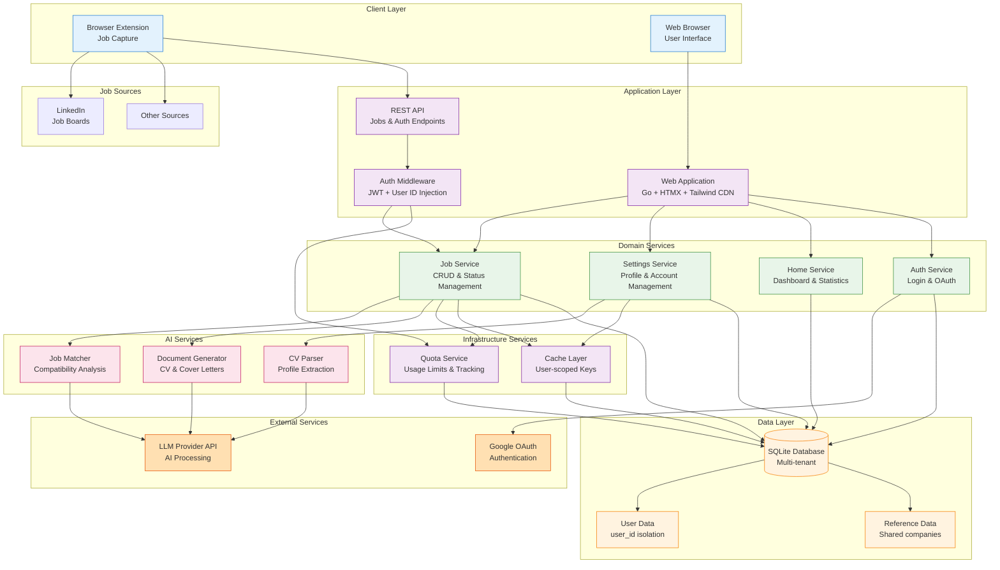

# Vega AI Architecture

## System Overview

Vega AI is a Go web application for AI-powered job search and application tracking, built with privacy and multi-tenancy in mind.



**Tech Stack:**

- **Backend:** Go with domain-driven layered architecture
- **Database:** SQLite with WAL mode and multi-tenant support
- **Authentication:** JWT sessions with username/password + Google OAuth
- **Frontend:** Go templates + HTMX + Hyperscript + Tailwind CSS (CDN)
- **AI:** OpenAI-compatible provider (Gemini, OpenAI, Ollama, etc.) for analysis, generation, and parsing
- **Caching:** Badger embedded database with user-scoped keys
- **Infrastructure:** Docker, GitHub Actions CI/CD

## Architecture Patterns

### Request Flow

**Handlers → Services → Repositories → Database**

- **Handlers:** HTTP request/response, template rendering
- **Services:** Business logic, AI integration
- **Repositories:** Data access with interfaces
- **Database:** SQLite with transaction support

## Database Design

### Schema Overview

**Core Entities:**

- `users` - Authentication and user accounts
- `companies` - Shared reference data
- `jobs` - Job postings with user isolation
- `profiles` - User experience, education, skills
- `match_results` - AI analysis results

**Multi-Tenancy Design:**

- User-specific tables include `user_id` foreign key
- All queries filtered by `user_id` at repository level
- Companies table is shared reference data (by design)

### Relationships

- User → Profile (1:1)
- User → Jobs (1:many)
- Company → Jobs (1:many)
- Job → MatchResults (1:many)

## Security & Privacy

### Authentication

1. **OAuth Flow:**
   - Google OAuth primary authentication
   - No passwords stored in database
   - JWT tokens for session management

2. **Token Management:**
   - Access tokens (60 min default)
   - Refresh tokens (168 hours default)
   - Secure cookie storage

### Multi-Tenant Data Isolation

1. **Row-Level Security:**

   ```go
   // All queries automatically filtered
   WHERE user_id = ? AND id = ?
   ```

2. **Repository Pattern Enforcement:**
   - User ID required for all operations
   - Automatic injection via middleware
   - Compile-time safety through interfaces

3. **Cache Isolation:**
   - Cache keys prefixed with user ID
   - Pattern: `job:u{userID}:*`
   - Automatic invalidation on updates

### GDPR-Compliant Logging

#### Core Principles

1. **No Direct PII in Logs** - Never log personal data
2. **Use References** - Anonymous identifiers only
3. **Hash Identifiers** - One-way hashes for correlation
4. **Event-Based** - Log events, not data

#### What NOT to Log

- Email addresses
- Usernames or names
- IP addresses
- OAuth tokens
- Any direct identifiers

#### What to Log

- User references: `user_123`
- Hashed identifiers
- Event types: `login_success`
- Anonymous metrics

#### Privacy Utilities

```go
// Get privacy-aware logger
log := logger.GetPrivacyLogger("module")

// Log auth events safely
log.LogAuthEvent("login_success", userID, true)

// Hash identifiers
hashedID := logger.HashIdentifier(email)

// Redact sensitive data
redacted := logger.RedactEmail(email) // j***e@example.com
```

## API Design

### RESTful Endpoints

#### Jobs API

```plaintext
POST   /api/jobs           # Create job (used by browser extension)
GET    /api/jobs/quota     # Get quota status
```

#### Authentication API

```plaintext
POST   /api/auth/login     # Username/password login
POST   /api/auth/google    # Exchange Google token for JWT
POST   /api/auth/refresh   # Refresh access token
```

#### Web Routes

```plaintext
# Authentication
GET    /auth/login         # Login page
POST   /auth/login         # Login form submission
POST   /auth/logout        # Logout
GET    /auth/google/login  # OAuth initiate
GET    /auth/google/callback # OAuth callback

# Jobs
GET    /jobs               # List jobs page
GET    /jobs/new           # New job form
POST   /jobs/new           # Create job
GET    /jobs/:id/details   # Job details page
```

#### System

```plaintext
GET    /health             # Health check
```

## AI Integration

### Service Architecture

- **JobMatcherService:** Analyzes job-profile compatibility using AI
- **LetterGeneratorService:** Creates personalized cover letters
- **CVGeneratorService:** Generates professional CVs from profiles
- **CVParserService:** Extracts profile data from uploaded CVs
- **LLM Interface:** Pluggable design with OpenAI-compatible client (supports Gemini, OpenAI, Ollama, vLLM, LM Studio)

### AI Flow

1. User profile and job data retrieved
2. Structured prompts generated using templates
3. LLM provider API processes the request
4. Results validated and sanitized
5. Match results stored in database for history

## Quota System

### Overview

The quota system manages usage limits for AI-powered features in cloud mode:

- **AI Analysis Quota:** Monthly limit for new job analyses (10/month)
- **Job Search Tracking:** Tracks job searches but no limits enforced
- **Unlimited Re-analysis:** Existing jobs can be re-analyzed without quota impact

### Implementation

```go
// Quota check before AI analysis
result, err := quotaService.CanAnalyzeJob(ctx, userID, jobID)
if !result.Allowed {
    // Handle quota exceeded
}

// Record usage after successful analysis
err = quotaService.RecordJobAnalysis(ctx, userID, jobID)
```

### Quota Types

1. **Monthly AI Analysis:** 10 analyses/month (cloud mode only)
2. **Job Search:** Unlimited for all users
3. **Self-hosted Mode:** No quotas enforced

## Configuration

### Environment Variables

```bash
# Core
TOKEN_SECRET=your-jwt-secret
AI_KEY=your-api-key

# Database
DB_CONNECTION_STRING=/app/data/vega.db?_journal_mode=WAL

# OAuth (Cloud Mode)
GOOGLE_CLIENT_ID=your-client-id
GOOGLE_CLIENT_SECRET=your-client-secret

# Features
CLOUD_MODE=true           # Enable multi-tenant mode
```

## Testing Strategy

### Test Levels

1. **Unit Tests:** Mock dependencies for isolated testing
2. **Integration Tests:** Real database interactions
3. **API Tests:** HTTP endpoint validation

### Running Tests

```bash
make test                  # Run all tests with coverage
make test-verbose          # Run tests with detailed coverage report
go test ./internal/auth/...  # Package-specific tests
```

## Performance Considerations

### Database Optimization

- SQLite WAL mode for concurrency
- Composite indexes on (user_id, field)
- Query optimization in repositories

### Caching Strategy

- User-scoped cache keys
- Automatic invalidation
- Badger cache for performance

## Deployment Architecture

### Local Development

```bash
docker-compose up
```

### Production Single-User

```bash
docker run -p 8765:8765 -v ./data:/app/data vega
```

### Production Multi-Tenant

```bash
docker run -p 8765:8765 \
  -e CLOUD_MODE=true \
  -e GOOGLE_CLIENT_ID=xxx \
  -e GOOGLE_CLIENT_SECRET=xxx \
  -e TOKEN_SECRET=xxx \
  -e AI_KEY=xxx \
  ghcr.io/benidevo/vega-ai:cloud-latest
```

## Code Organization Best Practices

1. **Domain Separation:** Each package owns its domain
2. **Interface Boundaries:** Repository interfaces in domain
3. **Dependency Injection:** Services receive dependencies
4. **Error Handling:** Wrapped errors with context
5. **Privacy First:** No PII in logs or errors

## Application Entry Points

The Vega AI application follows a clean, modular architecture with well-defined entry points and initialization flow:

### Main Entry Point

- **Location**: `cmd/vega/main.go`
- **Responsibilities**:
  - Creates application configuration via `config.NewSettings()`
  - Instantiates the main application struct
  - Handles startup and graceful shutdown
  - Minimal logic, delegating to the app package

### Application Core (`internal/vega/app.go`)

The `App` struct serves as the central application container:

```go
type App struct {
    config   config.Settings
    router   *gin.Engine
    db       *sql.DB
    cache    cache.Cache
    server   *http.Server
    done     chan os.Signal
    renderer *render.HTMLRenderer
}
```

### Initialization Flow

1. **New()** - Creates app instance
   - Initializes Gin router with default middleware
   - Configures CORS settings
   - Loads HTML templates (non-test environments)
   - Sets up template functions for rendering

2. **Setup()** - Prepares dependencies
   - Initializes logging system
   - Calls `setupDependencies()` for:
     - Database connection and configuration
     - Cache initialization (Badger or NoOp)
     - Database migrations
     - Admin user creation
   - Configures all routes via `SetupRoutes()`

3. **Run()** - Starts the server
   - Creates HTTP server with configured port
   - Registers OS signal handlers
   - Launches server in goroutine
   - Provides startup messages based on mode

4. **WaitForShutdown()** - Handles termination
   - Blocks on signal channel
   - Initiates graceful shutdown with timeout
   - Ensures proper cleanup

### Route Configuration (`internal/vega/routes.go`)

Central routing setup with clear separation:

- **Middleware Stack**:
  - Global error handler (panic recovery)
  - Security headers (configurable)
  - CSRF protection (configurable)

- **Route Groups**:
  - `/auth` - Authentication endpoints
  - `/jobs` - Job management (authenticated)
  - `/settings` - User settings (authenticated)
  - `/api/auth` - Auth API endpoints
  - `/api/jobs` - Jobs API (authenticated)
  - `/` - Homepage with optional auth
  - `/static` - Static file serving
  - `/health` - Health check endpoint

### Service Initialization

Services are initialized in dependency order:

1. AI Service (graceful degradation if unavailable)
2. Authentication service and handlers
3. Job service with cache integration
4. Quota service with repository adapters
5. Settings handlers with all dependencies
6. API handlers for REST endpoints

### Key Design Patterns

- **Dependency Injection**: Services receive dependencies through constructors
- **Graceful Degradation**: AI service failure doesn't crash the app
- **Mode-Based Configuration**: Cloud vs self-hosted behavior differences
- **Middleware Composition**: Flexible security and auth middleware
- **Clean Shutdown**: Proper resource cleanup on termination

This architecture provides clear separation of concerns, testability through dependency injection, and flexibility for different deployment modes.
